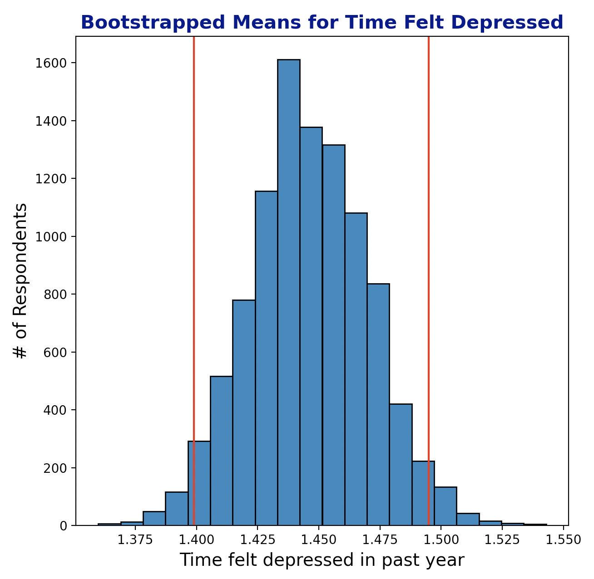

# Exploration and Bootstrapping of Overall Health and Happiness Data From the General Social Survey

## Technologies Used

* Pandas
* NumPy
* Scikit-Learn
* SciPy
* Matplotlib
* Seaborn

## Introduction
#### The General Social Survey is one of the most influential studies in the social sciences.  Respondents are interviewed in person usually for 90-120 minutes and the information collected includes demographic, health, financial, educational data and much more.  Something that makes this study so valuable is that it also includes respondents' opinions and beliefs on matters like government spending, the state of race relations, science, technology, and even philosophies about the nature of life.  I plan to revisit the GSS in future projects but for this project I chose to focus on some key variables from the study.

## Summary
#### For this project I explored and bootstrapped a few key variables from the 2016 administration of the GSS.  After choosing some initial variables to compare I started by creating plots to see the distribution of the variables and a heatmap of correlations.  A set of three significantly correlated variables were chosen to focus on: overall health, time feeling happy, and time feeling depressed.  I made a plot to show the distributions of those variables alongside eachother to help illustrate their relationship to eachother.  After that, I used bootstrapping to confirm that the responses and correlations in the sample data could be used to represent the population and plotted those results.

## Hypotheses
#### Null:   Health *is not* related to feeling happy more often.
#### Alternative:  Health *is* related to feeling happy more often.

## Distributions and Correlations
#### During the survey for a question like, "How often do you feel happy?" respondents could choose answers like *Almost never, Sometimes, A lot of the time, *or* Almost all the time*. I converted those answers to number scales.  The graphs and correlation heatmap below represent the distrubutions and correlations of survey reponses.  

##### Distribution of each feature after replacing NaNs with the mean of the feature.

##### Correlation heatmap.

##### Overall health ratings alongside time felt happy and time felt depressed.

## Bootstrapping
#### Using 95% confidence intervals I found that bootstrapping with 10,000 iterations produced normal distributions for each variable and the means of the bootstrapped samples aligned with the means of the original samples.

 

 

## Conclusion

#### The bootstrapping results indicate that the data accurately represents the relationships between health, feeling happy, and feeling depressed for the population of the United States in 2016.  As a result we're able to reject the null hypothesis and confidently say there is a significant relationship between overall health and the time a person feels happy.  This might be, for example, because being healthier contributes to feeling happier and/or because feeling happier contributes to better health.
